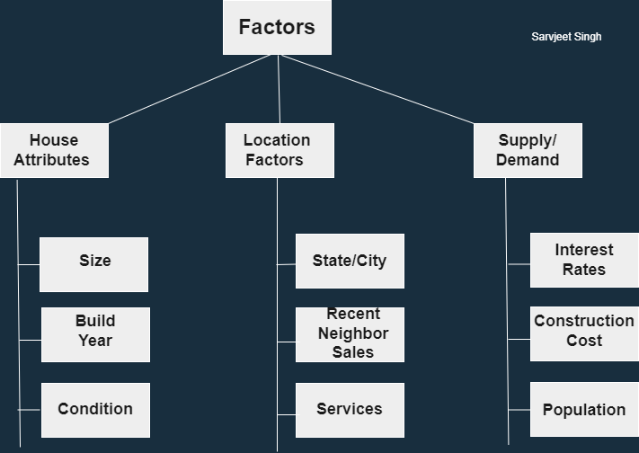

# Assignment
## There are total 9 factors that I have identified. We can divide them into 3 mutually exclusive classes and they will be collectively exhaustive.
1. House Attributes 
2. Location Factors
3. Supply/Demand Factor
   
  ## Here is the MECE representation  
  
  
  
  
  
   
1. House Attributes
They solely depend upon the house itself. These factors are

1. Size
This is the most relevant and influential factor. It is evident from various datasets that price increases as the size of the house increases.

2. Build Year
It defines ”How old the house is” ? Generally old houses do not have new facilities and this could be a very influential factor in the future.

3. Condition
It looks similar to the build year but it is somehow different. House price depends upon the maintenance of the house and it is different from having new technology in the house.
 
2. Location Factors

1. State/City
I have found in my analysis that some states have surprisingly high prices in comparison to others. These states and cities are the ones that mainly provide employment to large numbers of people. Thus, they generally have high prices of everything.

2. Near House Sales
Now, this factor can seem somehow  slightly not that relevant because neighbor house sales should not that much affect the price of the house. But it can be seen from different datasets and experts’ articles that people compare house prices with other house sales in that area. If someone in that area, due to some reason, is selling the house at a different price from the market rates then this will affect all neighbor house sales.

3. Services
When we talk about the services, it means distance and time for reaching hospital, shopping stores, school and other essential services required by people. In the future, home delivery availability or other related facilities will influence the house price.
 
3. Supply/Demand 
House prices are affected by supply and demand just as any good or services.

1. Interest Rates
It depends upon the GDP, mortgage rates, unemployment rate of the USA in the future which will affect the house prices.

2. Construction Cost
This factor will influence the cost to build new houses thus affecting the supply of the new houses. This incorporates all things like permits to make new houses, construction material costs, and old house maintenance costs.

3. Population
This factor directly affects the demand of houses. As the population increases people will need more space to live hence increasing the demand.

